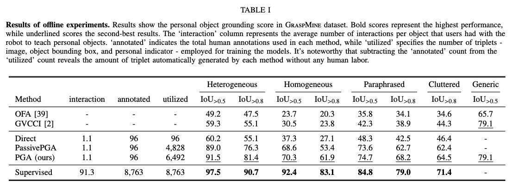
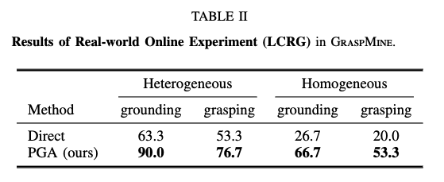

<div align="center">
<figure>
    
</figure>
<h1>PGA: Personalizing Grasping Agents with Single Human-Robot Interaction</h1>
  
**[Junghyun Kim][4], &nbsp; [Gi-Cheon Kang][3]<sup>\*</sup>, &nbsp; [Jaein Kim][5]<sup>\*</sup>, &nbsp; [Seoyun Yang][1], &nbsp; [Minjoon Jung][9], &nbsp; [Byoung-Tak Zhang][6]** <br>

**[Submitted to The 2024 IEEE/RSJ International Conference on Intelligent Robots and Systems (IROS 2024)][2]**
</div>

<h3 align="center">
<a href="https://arxiv.org/abs/2310.12547">arXiv</a> | <a href="https://drive.google.com">Poster (TBD)</a> | <a href="https://drive.google.com">Presentation Video (TBD)</a> | <a href="https://drive.google.com/file/d/19u1qsj27nRtMjNm-qS7syq_RuyTQxO42/view?usp=sharing">1 min Demo Video</a>
</h3>

## Overview
<br><br>

<br>
<br>

Citation
-----------------------------
If you use this code or data in your research, please consider citing:
```bibtex
@article{kim2023pga,
  title={PGA: Personalizing Grasping Agents with Single Human-Robot Interaction},
  author={Kim, Junghyun and Kang, Gi-Cheon and Kim, Jaein and Yang, Seoyun and Jung, Minjoon and Zhang, Byoung-Tak},
  journal={arXiv preprint arXiv:2310.12547},
  year={2023}
}
```

<br>
<br>

## Table of Contents
* [Environment Setup](#Environment-Setup)
* [GraspMine Dataset](#GraspMine-Dataset)
* [Reminiscence Construction](#Reminiscence-Construction)
* [Object Information Acquisition](#Object-Information-Acquisition)
* [Propagation through Reminiscence](#Propagation-through-Reminiscence)
* [Personalized Object Grounding Model](#Personalized-Object-Grounding-Model)
* [Personalized Object Grasping](#Personalized-Object-Grasping)
* [Experimental Results](#Experimental-Results)
* [Acknowledgements](#Acknowledgements)


<br>
<br>

Environment Setup
----------------------
Python 3.7+, PyTorch v1.9.1+, CUDA 11+ and CuDNN 7+, Anaconda/Miniconda (recommended) <br>

1. Install Anaconda or Miniconda from [here][8].
2. Clone this repository and create an environment:

```shell
git clone https://www.github.com/JHKim-snu/PGA
conda create -n pga python=3.8
conda activate pga
```

3. Install all dependencies:
```shell
pip install torch==1.9.1+cu111 torchvision==0.10.1+cu111 torchaudio==0.9.1 -f https://download.pytorch.org/whl/torch_stable.html
pip install -r requirements.txt
```

<br>
<br>


GraspMine Dataset
----------------------
GraspMine is an LCRG (Language-Guided Robotic Grasping) dataset collected to validate the grasping agent's personalization capability. 
GraspMine aims to locate and grasp personal objects given a personal indicator, *e.g.,* "my sleeping pills." 
GraspMine is built upon 96 personal objects, 100+ everyday objects.

<br>

### Training Set

Each sample in the training set includes:
1. An image containing a personal object.
2. A natural language description.

| Name  | Content | Examples | Size | Link |
| --- | --- |--- | --- |--- |
| `HRI.zip`  | Images from human-robot interaction | 96 | 37.4 MBytes | [Download](https://drive.google.com/file/d/17iTe82-SdfcA-jrK3l7CiKGqvSewfg7R/view?usp=sharing)|
| `HRI.json`  | personal object descriptions (annotations). Keys are the image_ids in `HRI.zip` and Values consists of [{general indicator}, {persoanl indicator}] | 96 | 8 KBytes | [Download](https://drive.google.com/file/d/1YnJPSPH0J9W5dp6dSdxp798tNVQa_IQJ/view?usp=sharing)|
| `HRI.tsv`  | preprocessed data for HRI. This consists of a image, a personal indicator, and the location of the object | 96 | 50.3 MBytes | [Download](https://drive.google.com/file/d/176SO_z__ndsahL1mjfyfuvS2ytSxvL-w/view?usp=sharing)|

Each element in `HRI.json` is as shown below.

<pre>
"0.png": ["White bottle in front","my sleeping pills"]
</pre>

Each element in `HRI.tsv` consists of a unique_id, image_id (do not use this), personal indicator, bounding box coordinates, image in string as shown below.

<pre>
0	38.png	the flowers for my bedroom	252.41,314.63,351.07,418.89	iVBORw0KGgoAAA....
</pre>

<br>

### Reminiscence

The reminiscence consists of 400 raw images of the environment. This raw images can be utilized in learning process, but annotations CANNOT be used in GraspMine.

| Name  | Content | Examples | Size | Link |
| --- | --- |--- | --- |--- |
| `Reminiscence.zip`  | Unlabeled images of Reminiscence | 400 | 129.4 MBytes | [Download](https://drive.google.com/file/d/1Y7W3RfHRAnQWteqhIJ8m-PfSyGLyZLhL/view?usp=sharing)|
| `Reminiscence_nodes.zip`  | Cropped object images of Reminiscence. All objects detected from the Object Detector are saved as a cropped image | 8270 | 61 MBytes | [Download](https://drive.google.com/file/d/1Y8YSS_4gAArQp94Ef9GhSaz18P0rBO2B/view?usp=sharing)|
| `Reminiscence_annotations.xlsx`  | Annotations of Reminiscence nodes. Each personal indicators are annotated with the {image_id}_{object_id} in the above `Reminiscence_nodes.zip` | 8270 | 4.4 MBytes | [Download](https://drive.google.com/file/d/1Y8YSS_4gAArQp94Ef9GhSaz18P0rBO2B/view?usp=sharing)|

<br>

### Test Set

Each sample in the test set includes:
1. Images containing multiple objects.
2. A natural language personal indicator.
3. Associated object coordinates.


| Name  | Content | Examples | Size | Link | Description |
| --- | --- |--- | --- |--- |--- |
| `heterogeneous.zip`  | Images of Heterogeneous split | 60 | 19.1 MBytes | [Download](https://drive.google.com/file/d/1asQ4mdsz1QenI90R51Xmo7-Bx2ZHTpVS/view?usp=sharing)| Scenes with randomly selected objects|
| `homogeneous.zip`  | Images of Homogeneous split | 60 | 18.6 MBytes | [Download](https://drive.google.com/file/d/1an8IKAVT0UBE0K9Hq5NbXApgvoCkZPhu/view?usp=sharing)| Scenes with similar-looking objects of the same category|
| `cluttered.zip`  | Images of Cluttered split | 106 | 36.6 MBytes | [Download](https://drive.google.com/file/d/1Y99XBJrXGw491ULXnf_JUiwTdL8Pzlob/view?usp=sharing)| highly cluttered objects. Sourced from the IM-Dial dataset|
| `heterogeneous.pth`  | Annotations for Heterogeneous images | 120 | 12 KBytes | [Download](https://drive.google.com/file/d/17ep-5ytYs686T30T8PFGxKjrnDzI67wM/view?usp=sharing)||
| `homogeneous.pth`  | Annotations for Homogeneous images | 120 | 12 KBytes | [Download](https://drive.google.com/file/d/17cw7gbtruCaIrkA9uiOgigfMIUQvCXU4/view?usp=sharing)||
| `cluttered.pth`  | Annotations for Cluttered images | 106 | 32 KBytes | [Download](https://drive.google.com/file/d/17ddpjki8mVORGhdoRqQQflr3ELspT6Ti/view?usp=sharing)||
| `paraphrased.pth`  | Paraphrased annotations for all splits | 346 | 49 KBytes | [Download](https://drive.google.com/file/d/17eTKdTnh1TJmrhwkduJQHOHHZo3UE9Lo/view?usp=sharing)| Each personal indicator paraphrased by annotators|


Each line in `heterogeneous.pth`, `homogeneous.pth`, `cluttered.pth`, `paraphrased.pth` is as shown below.

<pre>
This will be provided soon. You can either check on your own by downloading the above links
</pre>


<!--
Place the downloaded data in `./data` folder.
We expect data to be uploaded to the following directory structure:

    ├── data         
    │   ├── train       
    │   │   ├── HRI
    │   │   │   ├── 0.png      
    │   │   │   └── ...      
    │   │   └── HRI.json      
    │   ├── Reminiscence  
    │   │   │   ├── 0.png
    │   │   │   └── ...      
    └── 
-->


<br>
<br>


Reminiscence Construction
--------------------------------------
Once you recieve images from whereever (robot, web, etc.), you first need to extract visual features of objects (category, attribute, location) in images to generate the instructions.
For visual feature extraction, we leverage the pretrained classifiers and object detector from [Faster R-CNN](https://arxiv.org/abs/1506.01497) and [Bottom-Up Attention](https://arxiv.org/abs/1707.07998).
The code is originated and modified from [this repository](https://github.com/MILVLG/bottom-up-attention.pytorch).

We strongly recommend you to use a separate environment for the visual feature extraction.
Please follow the Prerequisites [here](https://github.com/MILVLG/bottom-up-attention.pytorch).

Extract the visual features with the following script:
```shell
cd visual_feature_extraction
python make_image_list.py
OMP_NUM_THREADS=4 CUDA_VISIBLE_DEVICES=0,1,2,3 python extract.py --load_dir ./output_caffe152/ --image_dir ../data/train/ENV1_train/ --out_path ../instruction_generation/data/detection_results/ENV1/r152_attr_detection_results --image_list_file ./ENV1_train_train_imagelist_split0.txt --vg_dataset ENV1_train --cuda --split_ind 0
```

The extracted visual feature should be saved as following:

    ├── instruction_generation        
    │   ├── data        
    │   │   ├── detected_results
    │   │   │   ├── ENV1_train   
    │   │   │   │   ├── r101_object_detection_results
    │   │   │   │   │   ├── ENV1_train_train_pseudo_split0_detection_results.pth
    │   │   │   │   ├── r152_attr_detection_results      
    │   │   │   │   │   ├── ENV1_train_train_pseudo_split0_attr_detection_results.pth

The results will be a dictionary of name of the image file for keys and list of each object's features for values.

<br>
<br>


Object Information Acquisition
--------------------------------------


<br>
<br>


Propagation through Reminiscence
--------------------------------------
Since you have a generated triplet of image, location, and instructions, you can train any visual grounidng model you want. 
Here, we provide a sample training and evaluation code of [OFA](http://arxiv.org/abs/2202.03052).
The source code is from [OFA Github](https://github.com/OFA-Sys/OFA).


The pre-trained checkpoints of PGA can be found below.

**Baseline checkpoints**
| OFA  | GVCCI | Direct | PassivePGA | PGA | Supervised |
| --- | --- | --- | --- | --- | --- |
| [Download]()| [Download]() | [Download]() | [Download]() | [Download]() | [Download]() |


**PGA checkpoints**
| 0  | 25 | 100 | 400 |
| --- | --- | --- | --- |
| [Download]()| [Download]() | [Download]() | [Download]() |


<br>
<br>


Personalized Object Grounding Model
--------------------------------------

<br>
<br>

Personalized Object Grasping
--------------------------------------

<br>
<br>


Experimental Results
--------------------------------------

<br><br>

<br><br>


Acknowledgements
-----------------
This repo is built upon [OFA](https://github.com/OFA-Sys/OFA), a vision-and-language foundation model. 
Thank you.


[1]: https://
[2]: https://iros2024-abudhabi.org/
[3]: https://gicheonkang.com
[4]: https://jhkim-snu.github.io/
[5]: https://github.com/qpwodlsqp/
[6]: https://bi.snu.ac.kr/~btzhang/
[7]: https://github.com/suyeonshin/
[8]: https://conda.io/docs/user-guide/install/download.html
[9]: https://minjoong507.github.io/
